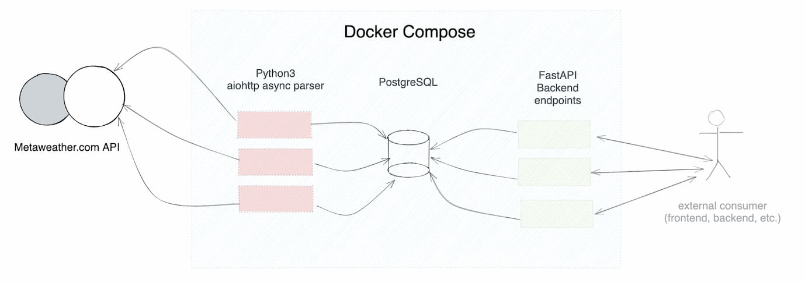

### Async metaweather.com extractor with FastAPI backend.

Just run the following command:

```
docker-compose up --build
```
and wait for the server to start.

High-level architecture:



The solution was build with aiohttp for asynchronous requests and fastAPI to provide the API endpoints.
TODOs:
— Add error handling when metaweather.com is down.
- Use primary key with built-in id from MetaWeather API
- Filter for existing data
- Add more tables (e.g.: city, woeid dictionary)
- Add more API endpoints
- Add Kafka and get rid of temporary .csv file
